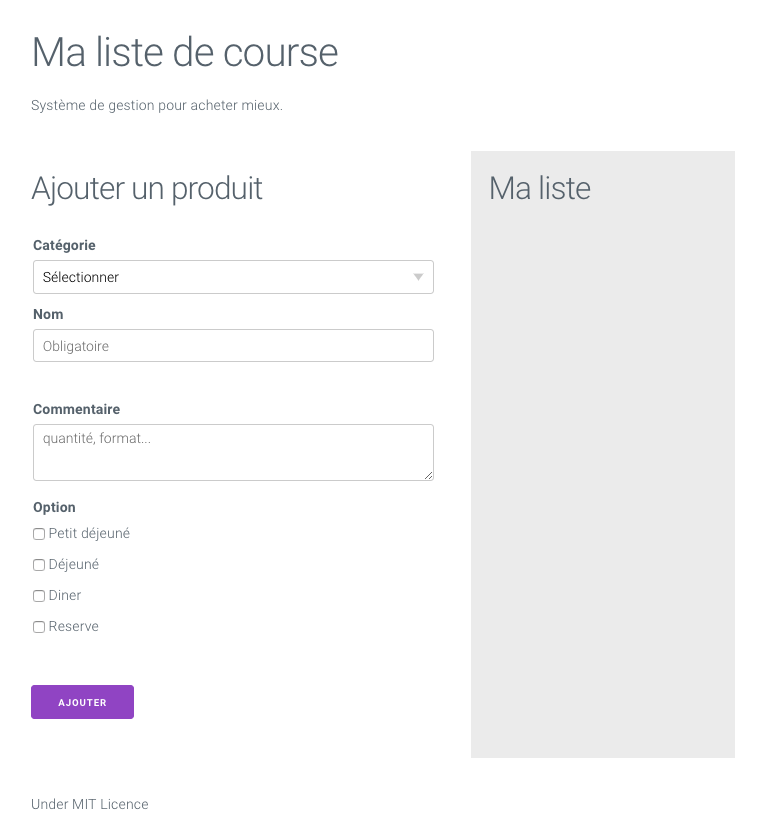

# Evaluation du 26 novembre : formulaire Javascript

Dans le cadre de votre formation aux technologies FrontEnd, vous avez appris les bases du traitement d'un formulaire en Javascript. Pour valider cette techniques vous devez aujourd'hui réaliser une application Web en Javascript qui consiste à réaliser une lite de course.

## Présentation du Rendu

## Travail à réaliser

### Configuration de la page HTML

Dans un premier temps vous devez ajouter les balises HTML dans le fichier `index.html`, ces balises doivent vous permettre de mettre en page la maquette présentée __ci-dessus__. Vous constaterez dans le fichier HTML que le CDN de Milligram est intégré, il vous permettra de ne pas avoir à faire de CSS.

### Ajout des l'interactivité Javascript

Une fois votre page HTML finalisée vous devez modifier le fichier `main.js` pour y intégrer toute la programation qui permettra de :

- Capter la soumission du formulaire
- Vérifier le contenu de chaque champs du formulaire
- Afficher un message d'erreur pour chaque champs non renseigné
- Supprimer les messages d'erreurs au focus | click sur les champs
- Ajouter le produit dans la liste HTML

## Critères d'évaluation

- 5 points pour le HTML
- 5 points pour la vérification des champs
- 5 point pour l'ajout des produits dans le liste HTML
- 5 points pour les bonnes pratiques (commentaire, indentation, ...)